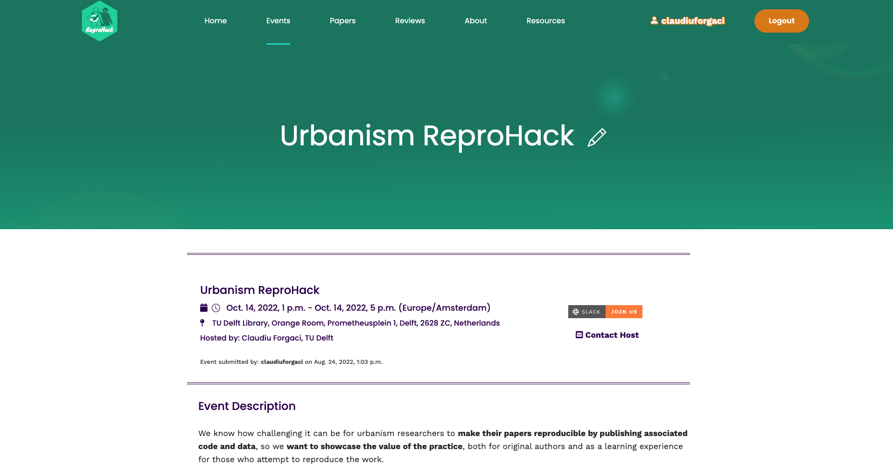

# Welcome

# Overview

## Rbanism

> - **Organised as part of [Rbanism](https://www.esciencecenter.nl/claudiu-forgaci/)**, a Netherlands eScience Center fellowship project.

> - **Rbanism aims to build capacity, competence, and confidence** for working with data and research software in the urbanism research community at large.

> - **This ReproHaack is the second of an event series** focusing on reproducibility, automation and scalability in urbanism research.

> - **Promote the practice of reproducibility and automation** necessary for accelerating scientific progress in urbanism and associated fields.

## Schedule

|   Time    |   Activity   |
|---    |---    |
|   13:00   |    Welcome and Orientation    |
|   13:15   |    TALK: Hugo Ledoux    |
|   13:45   |    Tips and Tricks for Reproducing and Reviewing     
|   14:10   |    Select papers, chat and coffee     |
|   14:20   |    Round I of ReproHacking      |
|   15:20   |    Re-group and sharing of experiences    |
|   15:30   |    Coffee break      |
|   15:45   |    Round II of ReproHacking - Complete Feedback form   |
|   16:45   |    Re-group and sharing of experiences    |
|   16:55   |    Feedback and Closing   |

## Getting to know you...

<!-- Add chart from survey? -->

## ...with respect to reproducibility

<!-- Add chart from survey? -->

# Why should we care about reproducibility?

## Motivating reproducibility

“Computational notebooks [...] open up the world of analytics to [...] disciplines that encompass diverse methodologies and skillsets [such as] urban planning [...] Some urban planners focus on policymaking [...] Others employ qualitative methods to work in and with vulnerable communities. Others develop simulation models to forecast urbanization patterns and infrastructure needs. Others intermingle these, and many more, different approaches to understanding and shaping the city. Yet **all urban planners benefit [or should!] from basic quantitative literacy and an ability to reason critically with data**. This scholarly and professional imperative aligns with **the growing importance of computational thinking in the urban context** and parallel trends in geocomputation [...], geographic data science [...], and the open-source/open-science movements [...].” ([Boeing, 2019, p. 40](https://doi.org/10.18335/region.v6i3.278))

## Motivating reproducibility

“**toolkits relying on point-and-click interfaces are inefficient in the era of big data.** 
Due to the limited scope for automation of tasks, not only is workflow efficiency 
reduced but also the reproducibility of the underlying research is compromised, 
because this largely depends on the (often undocumented) sequence of decisions 
manually operating the software. [...] We then argue that **the field [of urban morphology] 
needs a shift from dominant traditional geographic information system (GIS) environments 
based on a graphical user interface (GUI; e.g., QGIS or ArcMap) towards reproducible
open code-based workflows.**” ([Fleischmann et al., 2022, p. 3](https://onlinelibrary.wiley.com/doi/10.1111/gean.12302))

## Motivating reproducibility

> - Even qualitative work like literature reviews can be done in a systematic, reproducible and automated way (e.g., see 
[Krishnan et al., 2021](https://link.springer.com/chapter/10.1007/978-3-030-76059-5_24))
> - A reproducible workflow allows for close scrutiny and interaction with the data and results of a publication, potentially
leading to new insights as well (e.g., see [Cottineau, 2022](https://link.springer.com/article/10.1007/s11192-021-04256-8))
> - Reproducibility can contribute to increasing the scientific legitimacy of design-focused urbanism research 
often regarded as pseudoscientific (see [Marshall, 2012](https://link.springer.com/article/10.1057/udi.2012.22))

## However, these are potentials yet to meet

> - Everyone (urbanists and non-urbanists) struggles with reproducibility and it is a hindrance to moving science forward
> - Even with a fairly simple analysis challenges are usually faced in four main areas: organization, automation, documentation, and dissemination

# TALK: Hugo Ledoux

# Tips on reproducing and reviewing

## Four facets of reproducibility

1.  **Organization:** tools to organize your projects so that you don't have a single folder with hundreds of files

2.  **Automation:** the power of scripting to create automated data analyses

3.  **Documentation:** difference between binary files (e.g. docx) and text files and why text files are preferred for documentation

4.  **Dissemination:** publishing is not the end of your analysis, rather it is a way station towards your future research and the future research of others

# Reproducibility checklist

## Organization
- [ ] Are all data, code, results, and documentation housed within a monophyletic folder structure?
- [ ] Is your project folder structured to separate your data, code, documentation, and results?
- [ ] Can the project be run from the project's root folder?
- [ ] Is the project under version control?
- [ ] Do files use a consistent naming scheme that indicates what they contain?

## Workflow and automation
- [ ] Is the workflow clearly documented (with or without code)?
- [ ] Is your workflow scripted, i.e., using code? 
- [ ] Is your code well documented?
- [ ] Is your code modular, i.e., does it use functions?
- [ ] Are unit tests available for the code?
- [ ] Does your repository make use of continuous integration tools to insure internal reproduciblity?

## Documentation
- [ ] Is there a README file that indicates
  - [ ] the purpose of the project, 
  - [ ] who to contact with questions, 
  - [ ] a map of the directory structure, and 
  - [ ] a description of what software and hardware is needed to reproduce your workflow?
- [ ] Are there README files in each folder describing the contents of the folder, how they were acquired/generated?
- [ ] Is there a CITATION file that tells users how to site the project, data, and code?
- [ ] Does the project have a LICENSE file?
- [ ] Is the project's repository publicly available?

## Publication
- [ ] Are papers and reports from the project generated using literate programming tools so that results are not hard-coded?
- [ ] Does the project have a persistent identifier?

## Data
- [ ] Is the data included or linked, with instructions on how to obtain the data?
- [ ] If data is not included, is this because it is not necessary or generated as part of the project?
- [ ] Are your raw data (if any) and processed data files separated?
- [ ] If data is not open:
  - [ ] Is it accessible via a protocol?
  - [ ] Is there synthetic data provided so the project can be run?
- [ ] Is citation information available for the data?
- [ ] Does the data use open formats, such as CSV and TXT?

## Software
- [ ] Is there a list of dependencies? 
- [ ] Is a container available to run the project?
- [ ] Are version number of every external application used in the process?
- [ ] Does your project use only open software?

## Reproducibility checklist

Checklist available in `documents/checklist.md`

- Serves as a tool to help you think about the reproducibility of your data
analysis.
- Many of the questions can be thought of as having a yes/no answer.
- A better approach would be to see the questions as being open ended with
the real question being, "What can I do to improve the status of my project
on this bullet point?"
- With that in mind, you'll never get 100% of the bullets right for your project,
but you'll always be improving.

## How to review?

[{width=100%}](https://www.reprohack.org/event/21/)

